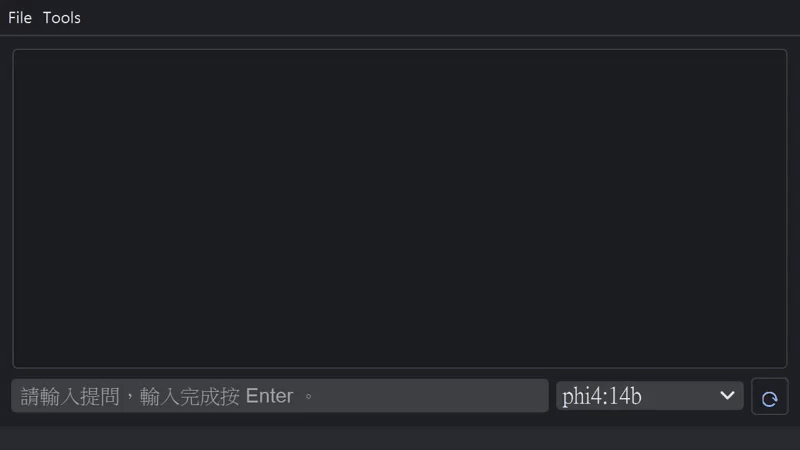

# Ollama Chat
Chat experience is similar to ChatGPT. Based on Ollama, it could be deployed locally.



## Introduction
- Deployed locally.
- Supports context reference.
- Supports streaming output and interrupting (Shortcut Ctrl+Shift+S during streaming).
- Easy to use. Just enter your question in natural language and press Enter.

## Requirements
- [Ollama](https://ollama.com/) and [LLM model(s)](https://ollama.com/search) installed first.
- Python 3 installed
   - Dependent on packages: pyqt5, pyqtdarktheme, darkdetect, ollama (installed via pip).
      ```shell
      pip install pyqt5, pyqtdarktheme, ollama
      ```
   - For Python 3.12, `pyqtdarktheme` requires given version and option `--ignore-requires-python` of `pip` command.
      ```shell
      pip install pyqtdarktheme==2.1.0 --ignore-requires-python
      ```

## Launch application
Launch with python command:
- **Windows**
  ```shell
  python OllamaChat.py
  ```
- **macOS / Linux**
  ```shell
  python3 OllamaChat.py
  ```

### Create executable file
You can use `pyinstaller` command to create direct executable file:
- **Windows**
```Shell
pyinstaller OllamaChat-win.spec
```
- **macOS**
```Shell
pyinstaller OllamaChat-macOS.spec
```